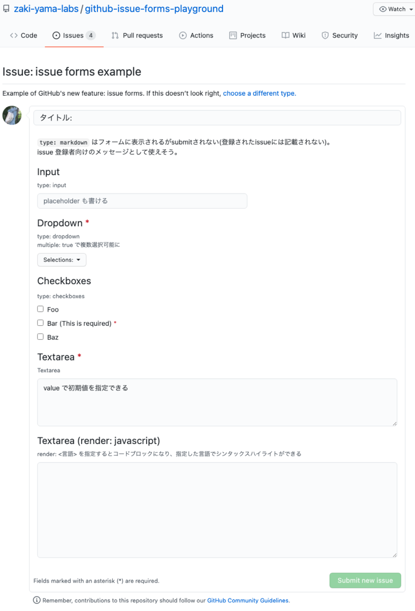

# GitHub Issue Forms Playground

A playground to try GitHub's new feature: [issue forms](https://docs.github.com/en/communities/using-templates-to-encourage-useful-issues-and-pull-requests/configuring-issue-templates-for-your-repository#creating-issue-forms)

Feel free to file issues!

## References

- [Issues forms beta for public repositories | GitHub Changelog](https://github.blog/changelog/2021-06-23-issues-forms-beta-for-public-repositories/)
